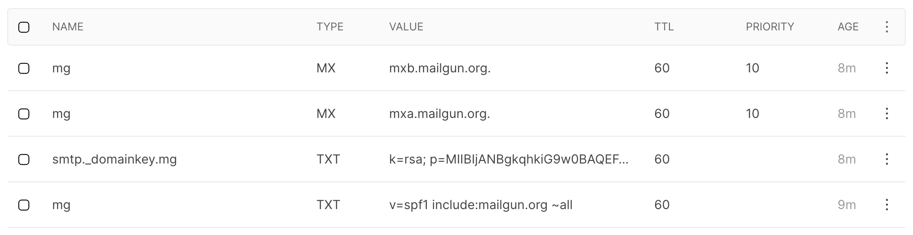

# Login-as-a-Service

_Simple plug-and-play login/signup/leads service (using email), compatible with Vercel serverless functions._

## Features

- Sign up/Login via “magic link” email (no password)
  - Also “signup-direct” mode with quick signup without email verification
- Lead collection
- Payments with Stripe Link: one-time purchases, credits, and subscriptions
- Invites (coming)
- SMS support (coming)

## How to use (login/signup flow)

### How to set up a new App

1. Set up your `app` in the database. Point `redirect_url` to the page to process logins (e.g. `https://myapp.com/authenticate`).
2. Set up Mailgun for email (see below). Place Mailgun values for domain, API key, (server) in database `app` or as global fallback values `DEFAULT_EMAIL_*`.
3. Create a client-side login/signup form in your app code.

### How to log in (or signup) a user

1. ➡️ Submit `POST /api/[app]/login` (or `lead`/`signup`/`signup-direct` – see “Login/Signup/Lead” below), with body of at least `{ email }`.
2. 📧 An email is sent to the user, when link is clicked they are forwarded to `redirect_url` page with query `?token=` (a JWT token with `person_app.user_id` encrypted).
3. ⬅️ Fetch `GET /api/[app]/people/[token]` to get the User object.
4. 💾 Store (at least) `token` in a cookie/localStorage.

### Example client-side code

A React Hook implementing steps 1 (`loginUser`) and 3-4 (`authenticateUser`):

    export const useUser = function () {
      const [user, setUser] = useState()

      useEffect(() => {
        const user = getCookie(COOKIE_NAME) ? JSON.parse(getCookie(COOKIE_NAME)) : undefined
        console.log(`User:`, user)
        setUser(user)
      }, [])

      const loginUser = async (personInfo) => {
        const result = await fetch(`${config.loginService}/signup`, {
          method: 'POST',
          headers: {
            Accept: 'application/json',
            'Content-Type': 'application/json'
          },
          body: JSON.stringify(personInfo)
        })
        if (result.status === 200) {
          googleEvent('user_signup')
          return true
        } else {
          console.warn({ result })
          const json = await result.json()
          throw new Error(`Login error: ${json.message}`)
        }
      }

      const authenticateUser = async (token) => {
        if (!token) return
        const person = await fetch(`${config.loginService}/people/${token}`).then(res => res.json())
        const { username } = person
        if (!username) throw new Error(`Could not log in user – user token is invalid`)
        const userObj = { username, token }
        if (isClientSide()) setCookie(COOKIE_NAME, userObj)
        return person
      }

      return { user, loginUser, authenticateUser }
    }

### Mailgun setup

https://app.mailgun.com/app/sending/domains/mg.MYDOMAIN.com




## How to Start

    yarn dev


## API

### Login/Signup/Lead

- `POST /api/[app]/lead`: Create new lead (create new user if it doesn’t exist, don’t send email)
- `POST /api/[app]/signup`: Create new user (create new user if it doesn’t exist, send login email)
- `POST /api/[app]/signup-direct`: Create new user without email verification (create new user only if it doesn’t exist _in this app_ – otherwise treat as `login` (send login email) and responds with `person` object including JWT `token`)
- `POST /api/[app]/login`: Login existing user (don’t create new user, send login email)

JSON fields:

- `email` (required)
- `username` (autogenerated from `email` if not provided)
- `firstName`
- `lastName`
- `country` (code)
- `...metadata` for everything else

### Get user info and statistics

- `GET /api/[app]/people/[token]`: get user info from a JWT token:

    ```
    {
      "user_id_numeric": 123,
      "user_id": "e93fc8605c0940a0af6ce0fdb22f2e5c",
      "username": "tomsoderlund",
      "email": "tomsoderlund@email.com",
      "first_name": "Tom",
      "last_name": null,
      "country": null,
      "can_login": true,
      "subscribe_email": true,
      "subscribe_sms": true
    }
    ```

- `GET /api/apps/[app-secret]/people`: get user list with email address.
- `GET /api/stats`: see user count etc for every app.

### Payments with Stripe

http://localhost:3102/test-payments.html

- `POST /api/[app]/people/[token]/payments/purchase`: Create a one-time purchase:

	```
	{
    amount: 500,
    currency: 'usd',
    productName: 'Product',
    quantity: 1,
    successUrl: '[ORIGIN]/success',
    cancelUrl: '[ORIGIN]/cancel'
  }
	```

- `POST /api/[app]/people/[token]/payments/purchase-credits`: Buy credits (price and currency set in `app` table):

	```
	{
    quantity: 10, // Nr of credits to purchase
    // You can use same props as with /payments/purchase but not needed
  }
	```

- `POST /api/[app]/people/[token]/payments/use-credits`: Use/consume credits: `{ quantity: 1 }`
- `POST /api/[app]/people/[token]/payments/subscription`: Create a recurring subscription (`priceId` is from Stripe):

	```
	{
    priceId,
    quantity = 1
  }
	```

## Todo

- [ ] Support multiple apps per user in shared metadata
- [ ] Subscriptions
  - [ ] Send email/SMS to all subscribers
  - [ ] Subscribed (field in person_app)
  - [ ] Unsubscribe route
- [ ] Invite other users
- [ ] SMS support
- [ ] Approve leads: set flag + send email

Maybe:

- [ ] Create app via API (needed? or use metadata?): POST /api/apps
- [ ] Redirect: GET /api/[app]/redirect then forward (set is_confirmed + tracking)
- [ ] Time-limited tokens
- [ ] Is this token valid? route Reset token GET /api/[app]/sessions/[jwt]
- [ ] createPerson “after creation” function

invalid signature = JWT error

Done:

- [x] 🐜 duplicate key value violates unique constraint "app_username_unique_idx" (same username & same app_id)
- [x] Fallback email account when not specified on app level
- [x] Inverted flow (`signup-direct`): sign up, email if NOT user
- [x] 🐜 Email force lowercase
- [x] 🐜 Usernames: when only numeric not NULL
- [x] Also numeric `user_id_numeric` = 
- [x] Signup set existing user can_login = true **DONE?**
- [x] Unique username for that person_app
- [x] See stats: /api/stats
- [x] Email list for each app: /api/apps/SECRET/people
- [x] Client save cookie
- [x] GET /api/[app]/people/[token]: token -> person
- [x] Store userId internally in app
- [x] Email lib
- [x] Lead signup: POST /api/[app]/lead
- [x] Log in: POST /api/[app]/login (won’t create new)
- [x] POST /api/[app]/signup
- [x] Boolean “can_login” (lead: false, login/signup: true)
- [x] Update user: PATCH /api/[app]/people/[token]: Update user
